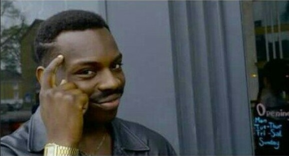
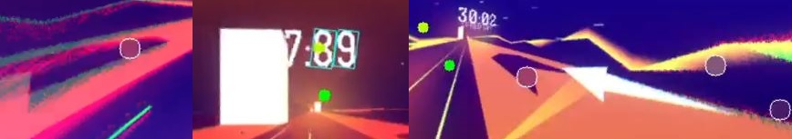
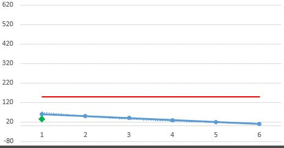
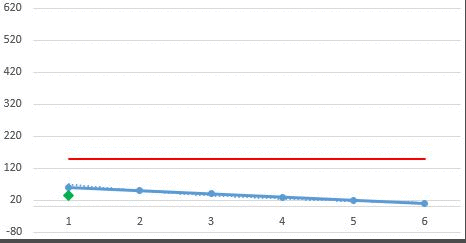
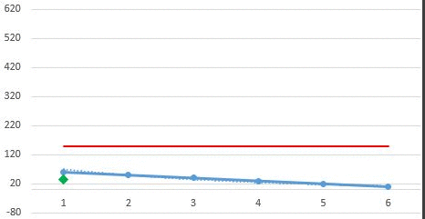
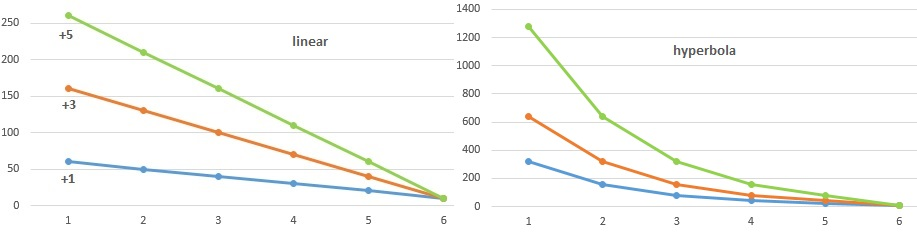
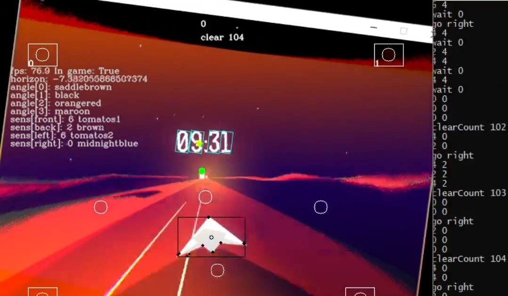
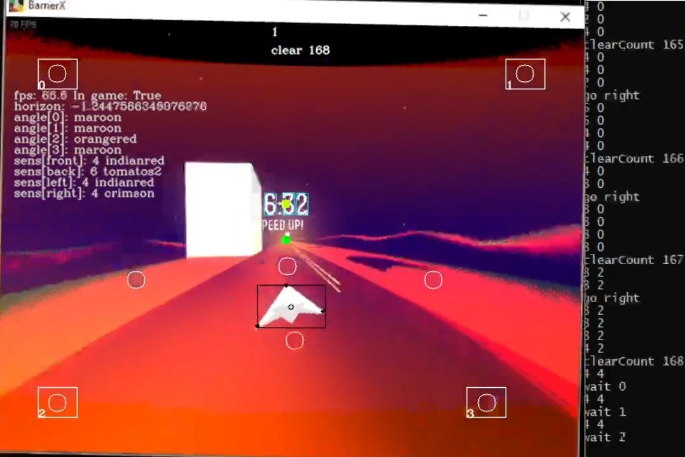
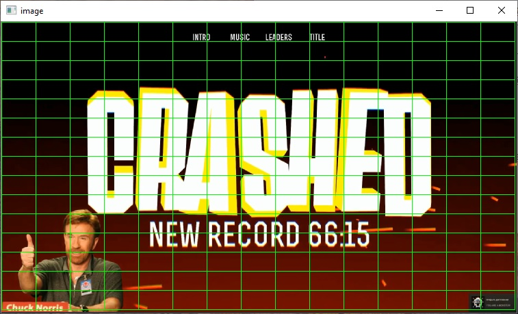

# BarrierXbot

What can be easy than to beat the last level of simple game BARRIER X ?
And what about to hold for 60 seconds and get achievement "**You are a monster!**"?
It's easy if you an a bot!

## Demo


## Usage

Tested on Python 3.8.6 win32. Be careful with **OpenCV** and **numpy** compatibility (you know).

1. install **requirements.txt**
2. start game in windowed mode (better with low resolution)
3. start **xBot.py**
4. start level in BarrierX
5. enjoy!

## How it work

Sensors is the main idea of xBot. They monitoring color changing in certain zones. xBot use 8 sensors for 2 different tasks:

* 4 to detect that xBot in game (corners sensors). xBot return keyboard controlling by particular combinations of colors.
* 4 to detect tracks around plane (plane sensors). Inform where he'll be safer.

Sounds simple in theory, but it is more difficult to translate the theory into practice. Watch original gameplay video for some times and think about this. 


Here are just some of the difficulties:

* camera and plane change self position. Often asynchronously.
* plane can change shape and size in big range
* visual effects such as: shake, rotation, stretching and etc
* tracks with different hazard can have same color
* high gameplay speed requires fast reaction

My friend said me that it's easy - just always walk to left.



I'm not a supporter of walking to left, but I had tried. The result was slightly better than if I had played with closed eyes. The next tip that he said - always walk to right. Yep, I had tried and this too. I don't know which gacha generator inside this game, but this attempt was better. I almost reached 60 seconds very close, but once.

So as your can see, there are many ways to find solution. Of course you can use deep learning like [YOLOv4](https://github.com/hhk7734/tensorflow-yolov4) or classic object detection. But why do need use ready solution if you can make your own?


Without going into details there are main steps of processing:

1. Edge detection with Canny.
2. Object classification by shape, size and color. For example:
   * if object have 4 edges and it is long - 90% that it is block
   * if object have many edges and it located at the bottom - it is a plane
   * if it is group of objects with many edges and they are near center - it's timer
3. Using timer for camera angle determination and find finish target - the place of plane destination
4. Rotate image to horizontal position.
5. Get plane center and size to create plane sensors. When agent know where finish and plane, he can looking for blocks on his way. It must be after image rotation because this place always placed under the timer.
6. Sensors check their zones and update color information
7. Bot ask sensors for color to decide what to do.

Each of this steps have its own algorithm, but sensors are more interesting. Just like any other similar system, you will have errors (type I and II). It doesn't matter if you can exclude or correct their.

For timer detection it may find only 2 digits that shifts the center and camera angle. Or doesn't find it at all. For track we can get color from hole, that is incorrect.



So what the correction algorithm I used? Average value. All sensors stored values and calculate mean of them. If sensor can't get new value it take the last one. xBot use mean, not the current.

All magic is how to calculate this mean. You must find optimal function and size set of numbers. For example take fixed set size with 6 values (frames) from single sensor and where all values is 10 (measured in RED RGB range 0-255). Will call it **buffer**. Mean for him will be 10.

Now add value 100 by new frame and buffer will be `[100, 10, 10, 10, 10, 10]`. Take the next frame with same value and buffer changed to `[100, 100, 10, 10, 10, 10]`.  I think you already understand that new value is shifting values in a list to right. Let's find mean for each buffer from some frames:

```python
avg([10, 10, 10, 10, 10, 10]) = 10
avg([100, 10, 10, 10, 10, 10]) = 25  # (100+10*5)/6 if it is difficult for you =)
avg([100, 100, 10, 10, 10, 10]) = 40
avg([10, 100, 100, 10, 10, 10]) = 40
avg([10, 10, 100, 100, 10, 10]) = 40
avg([10, 10, 10, 100, 100, 10]) = 40
```

At the second frame sensor informed that his mean is 25. At the third and following frames - 40. Arithmetic mean have significant disadvantage - it give same means regardless of the order. If at the second frame we can say that 100 is may be mistake, then at the third frame it was a high probability of danger. At last frame we almost can ignore 100 because they was a 4 frames ago. 

Ok, we can give high weights for new values and low for old, like linear function. Also need some coefficient, let's say that newer values have +1 more weight than previous. Let's find new means:

```python
[10x6, 10x5, 10x4, 10x3, 10x2, 10x1]   -> [60, 50, 40, 30, 20, 10];   avg = 35
[100x6, 10x5, 10x4, 10x3, 10x2, 10x1]  -> [600, 50, 40, 30, 20, 10];  avg = 125
[100x6, 100x5, 10x4, 10x3, 10x2, 10x1] -> [600, 500, 40, 30, 20, 10]; avg = 200
[10x6, 100x5, 100x4, 10x3, 10x2, 10x1] -> [60, 500, 400, 30, 20, 10]; avg = 170
[10x6, 10x5, 100x4, 100x3, 10x2, 10x1] -> [60, 50, 400, 300, 20, 10]; avg = 140
[10x6, 10x5, 10x4, 100x3, 100x2, 10x1] -> [60, 50, 40, 300, 200, 10]; avg = 110
```

It's look better! Now we don't worry if **avg < 100**. If **avg > 100** we must be wary. And **avg > 150** means a dragon level dangerous. This solution is resistant to outliers (single different value) and to drifting (unexpected deviation). Speaking of drifting, I mean when in set [100, 10, 100] the second value is a mistake. 

Illustration for clarity where we have:

* blue line - buffer with historic values of 6 last colors. Values had modified after interpretation function.
* red line - threshold for dangerous. Set 150
* dotted line - exponential trend
* green dot - mean of buffer values

Outlier. The green dot remained under the red line, which means that we neutralize the outlier.



Second value confirming first. The green dot crossed the red line and bot must react. If third value was high too then mean will be high too. It allow to use a few levels of dangerous. Low level inform bot that he can search better track beside, but he have some time to wait more better choice. High level inform that no time to choosing and he must react now.



Drifting or reverse outlier. Despite the deviation in the second value there is still a high tendency to danger. When bot get  third value he doesn't consider it as outlier, but confirm as danger.



Also you can change function for interpretation or use another. If you want to enhance weight for newest values and weaken for oldest, you can change the step of coefficient. Take the buffer  `[10, 10, 10, 10, 10, 10]`



And this is not the end! All this works only with numbers. <u>But agent worked with colors</u>. I use RGB color model which range can be written by 3 numbers in range 0-255. I don't use HSV because converting reduces performance. So I used three buffers for each RGB channel. Next I limited range for means. If earlier weight meant how much the value would increase, now it means how many times the value will be duplicated.

```python
old [200x3, 160x1] -> [600, 160];			 avg = 380
new [200x3, 160x1] -> [200, 200, 200, 160];	 avg = 190
```

Now when I got mean for each color channel I can get mean of color. But standard color depth is 16,7 mls colors. How to set the threshold for warning signal? I used [webcolors](https://github.com/ubernostrum/webcolors) (customized) library to reduce count of colors shades by grouping the similar and return human titles. All titles are classified by danger 0-10. 

Here example where agent decide turn to right.



And here example where agent decide to waiting for the better case.



It's simplify model for you understanding. Off course this is not at all tweaks but you're already tough if you've read this all. If you liked it, you can see another bot for this game [NagiBot](https://github.com/kideath/BarrierX_NagiBot) - he realized an idea to separate tracks and take the mean color for each of them. And it work good.


## Settings

All settings are stored in **xbot.cfg**

### [general]

***target*** - full or part of window title to capture. For example, you can set title of video with BarrierX gameplay to debag xBot.

### [sensors]

These zones are obtained when xBot split the image on a grid. You can set which zones will become sensors. Also, you can control sensors size by setting count of columns and rows in the table.

***showgrid*** - enable grid overlay. Help you to set sensors positions.



***gridcolums*** - count of grid columns. More quantity than columns count can be better for video with 16:9 ratio. For 4:4 ratio use the same quantity

***gridrows*** - the same as ***gridcolums***

***cornerPos*** - position number of cell by grid for ingame sensors. They must be located at the corners. If all this sensors is dark - it decide that agent not in the game.

***reaction*** - coefficient for interpretation function. It means how fast sensor will react on color changing. Using `1 ` with `bufferSize=7`  at 70fps give good results. Try not using high values.

***bufferSize*** - how many previous color values will stored. It need for calculating mean of color. Try use fps/10 (for 30fps use sensors `bufferSize` ~3). 

